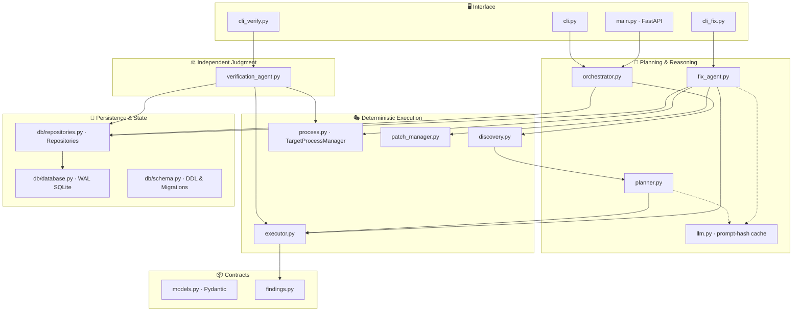
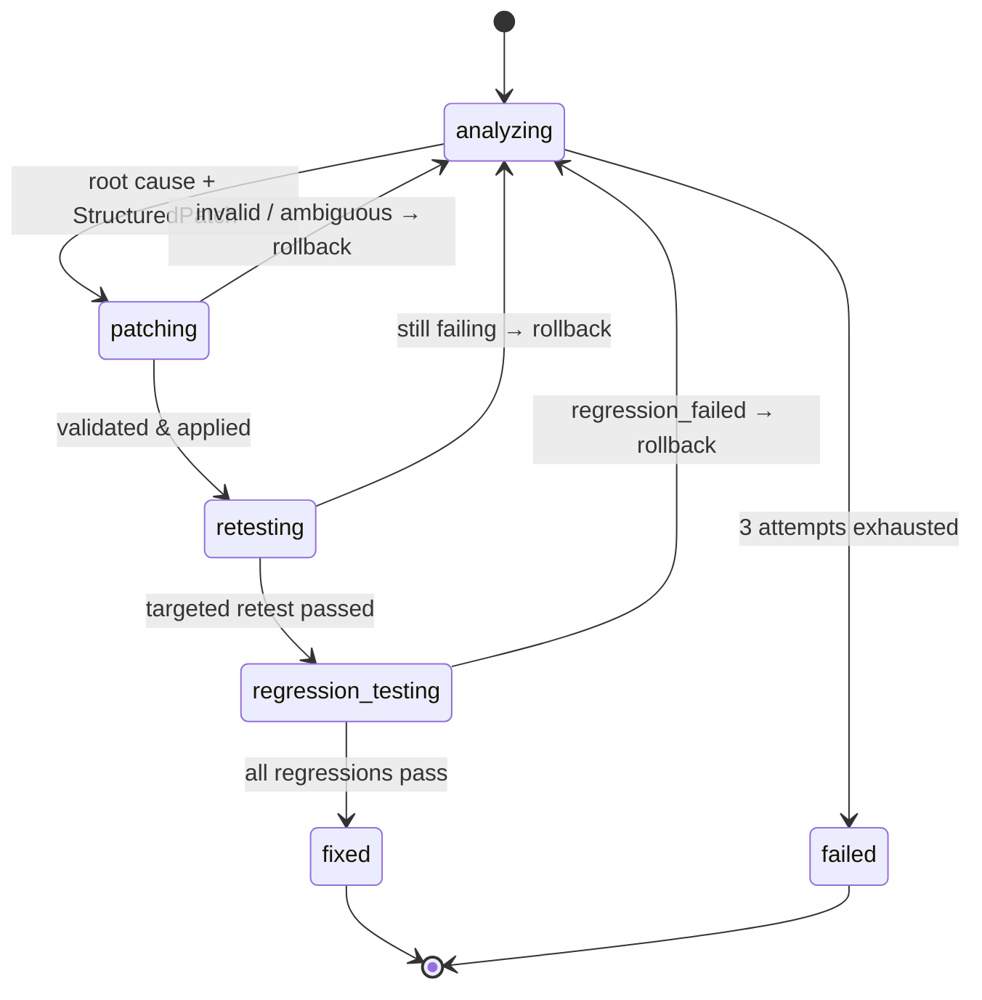
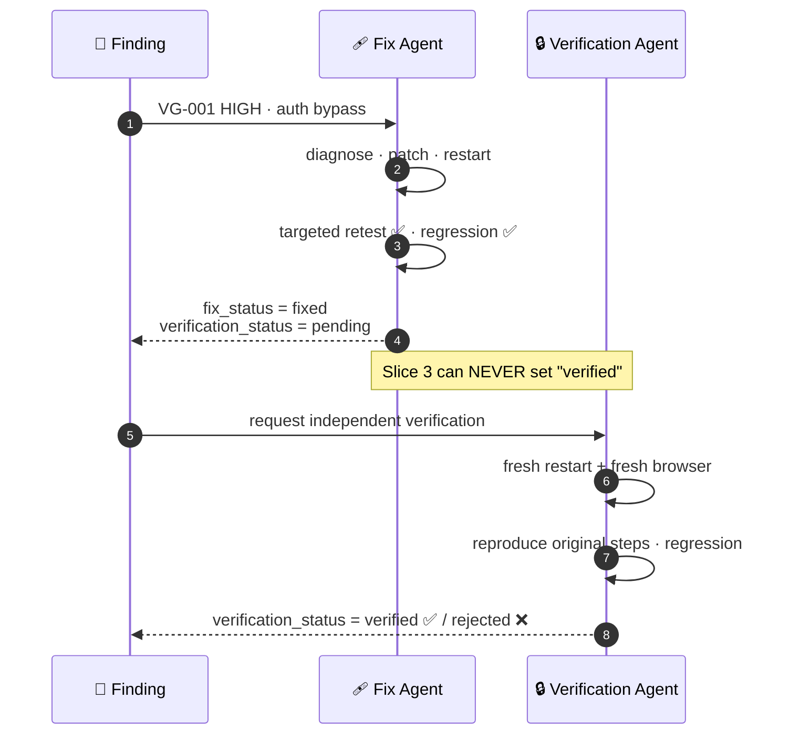

<div align="center">

# 🛡️ VibeGuard AI

### *Your AI wrote the app. VibeGuard proves whether it holds up.*

**Autonomous attack → fix → independent verification for AI-built web applications.**

<br/>


<br/>

```
  ╔══════════════════════════════════════════════════════════════════════════╗
  ║   AI-BUILT APP ─▶ DISCOVER ─▶ VIBE ATTACK ─▶ EVIDENCE ─▶ FINDINGS        ║
  ║                                                   │                      ║
  ║                    VERIFY ◀─ REGRESSION ◀─ FIX ◀──┘                      ║
  ╚══════════════════════════════════════════════════════════════════════════╝
```

**[The Loop](#-the-loop)** · **[Architecture](#-architecture)** · **[Slices](#-built-in-slices)** · **[Trust Model](#-the-trust-model)** · **[Quickstart](#-quickstart)** · **[Demo](#-the-demo-story)**

</div>

---

## ✨ Why VibeGuard?

"Vibe-coded" apps ship fast — and ship with holes. Missing auth guards, unvalidated inputs, broken state handling. Humans rarely have time to adversarially test what an LLM generated in minutes.

**VibeGuard closes the loop autonomously:**

<table>
<tr>
<td width="25%" align="center">🔍<br/><b>Discovers</b><br/><sub>Crawls the app and builds a structured App Map</sub></td>
<td width="25%" align="center">⚔️<br/><b>Attacks</b><br/><sub>Plans adversarial scenarios like a hostile user</sub></td>
<td width="25%" align="center">🩹<br/><b>Fixes</b><br/><sub>Diagnoses root cause and applies a structured, exact-match patch</sub></td>
<td width="25%" align="center">✅<br/><b>Verifies</b><br/><sub>A separate agent re-proves the fix in a fresh browser</sub></td>
</tr>
</table>

> [!IMPORTANT]
> **Core principle — AI plans, Playwright executes.**
> The LLM never runs arbitrary browser commands or rewrites arbitrary files. Every action passes through a schema-validated **Action DSL**; every code change passes through a constrained **Structured Patch**.

---

## 🔁 The Loop

```mermaid
flowchart LR
    A["🌐 Target App"] --> B["🔍 Discovery<br/>App Map"]
    B --> C["⚔️ Vibe Attack Planner<br/>(Gemini / deterministic)"]
    C --> D["📜 Action DSL<br/>validation"]
    D --> E["🎭 Playwright<br/>execution"]
    E --> F["🧾 Evidence<br/>+ flake re-runs"]
    F --> G["🚨 Structured<br/>Findings"]
    G --> H["🩹 Fix Agent<br/>Slice 3"]
    H --> I["🔒 Verification Agent<br/>Slice 4"]
    I -->|verified| J(["✅ VERIFIED"])
    I -->|rejected| K(["❌ REJECTED"])

    style A fill:#1e1b4b,stroke:#818cf8,color:#e0e7ff
    style G fill:#7f1d1d,stroke:#f87171,color:#fee2e2
    style H fill:#78350f,stroke:#fbbf24,color:#fef3c7
    style I fill:#064e3b,stroke:#34d399,color:#d1fae5
    style J fill:#065f46,stroke:#10b981,color:#ecfdf5
    style K fill:#991b1b,stroke:#ef4444,color:#fef2f2
```



---

## 🏗️ Architecture

<details open>
<summary><b>Layered view</b></summary>



</details>

---

## 🧩 Built-in Slices

VibeGuard is built in **vertical slices** — each one end-to-end, each one preserving the last.

| Slice | Name | Pipeline | Status |
|:-:|---|---|:-:|
| **1** | 🔍 Discovery & Action DSL | `Target → AppMap → Plan → DSL → Playwright → Findings` | ✅ |
| **2** | ⚔️ Vibe Attack | `AppMap → Adversarial Scenarios → Evidence → Findings` | ✅ |
| **3** | 🩹 Fix Agent | `Finding → Diagnose → Patch → Restart → Retest → Regression → FIXED` | ✅ |
| **4** | 🔒 Independent Verification | `FIXED → Fresh Context → Reproduce → Regression → VERIFIED / REJECTED` | ✅ |
| **5** | 💾 SQLite Persistence & Run Mgmt | `Runs → Attacks → Findings → Fixes → Verification → Event Stream in SQLite` | ✅ |
| 6+ | 📊 Live SSE Dashboard · Reliability Score | — | 🔜 |

<details>
<summary><b>🔍 Slice 1 — Discovery & Action DSL</b></summary>

<br/>

- **Deterministic crawler** (`discovery.py`) visits pages, records redirects, extracts accessible elements as DSL targets (`label:Email`, `role:button:Sign in`).
- **Action DSL** — the only vocabulary the AI may speak:

| Navigation | Input | Assertions | Environment |
|---|---|---|---|
| `navigate` · `goto` | `fill` · `clear` | `expect_url` | `resize` |
| `reload` · `go_back` · `go_forward` | `click` · `double_click` | `expect_text` · `expect_no_text` | |

</details>

<details>
<summary><b>⚔️ Slice 2 — Vibe Attack</b></summary>

<br/>

| Category | Attacks |
|---|---|
| 🧪 **Functional** | Empty required fields · malformed email · 5000-char boundary payload · duplicate rapid submits |
| 🔑 **Authentication** | Direct protected-route access · revisit after logout · invalid credentials |
| 🛂 **Authorization** | `?role=admin` escalation · restricted scope probing |
| 🔄 **Reliability / State** | Refresh mid-workflow · unexpected back/forward navigation |
| 📱 **UX** | Mobile viewport `375×812` · visible error feedback |

**Evidence per failure:** action history · DOM text excerpt · console errors · network events · screenshots · final URL.
Failures are **re-run up to 3×** to separate real defects from flakes.

> [!NOTE]
> Findings must be **semantically meaningful**. The malformed-email attack does not merely check the URL — it asserts the registration *did not complete* (the sign-in completion marker must not appear), so a legitimate redirect is never misreported as a defect.

</details>

<details>
<summary><b>🩹 Slice 3 — Fix Agent</b></summary>

<br/>



**Structured patches only** — no free-form file rewrites:

```json
{
  "file": "demo-app/server.js",
  "operations": [
    {
      "type": "replace",
      "old_text": "app.get(\"/dashboard\", (req, res) => {",
      "new_text": "app.get(\"/dashboard\", (req, res) => {\n  if (!sessionUser(req)) return res.redirect(\"/login\");",
      "expected_matches": 1
    }
  ]
}
```

| Guardrail | How |
|---|---|
| 🎯 Exact-match | `old_text` must occur **exactly** `expected_matches` times — ambiguity is rejected |
| 📁 Path jail | Every path resolved and constrained inside the workspace |
| 💾 Restorable | Originals snapshotted to an out-of-tree temp dir; any failure → `rollback()` |
| 🔁 Controlled restart | `TargetProcessManager` restarts the app and waits for health |
| 🔂 Bounded retries | Max **3** diagnose→patch→test attempts |
| 🧯 Offline fallback | No `GEMINI_API_KEY` → deterministic auth-guard patch |

</details>

<details>
<summary><b>🔒 Slice 4 — Independent Verification</b></summary>

<br/>

The Verification Agent **shares no state with the Fix Agent**. It:

1. Restarts the target app from disk.
2. Launches a **fresh Chromium context**.
3. Rebuilds the targeted test **from the original finding's steps** — not from the fixer's claims.
4. Runs a deterministic regression suite (same-category + baseline tests).
5. Emits `verified` (confidence `1.0`) or `rejected` with a reason and fresh evidence.

</details>

<details>
<summary><b>💾 Slice 5 — SQLite Persistence & Run Management</b></summary>

<br/>

VibeGuard persists runs, attacks, structured findings, fix iterations, verifications, and audit events into a high-concurrency relational store:

- **Engine**: SQLite with Write-Ahead Logging (`PRAGMA journal_mode = WAL;`) and enforced Foreign Keys (`PRAGMA foreign_keys = ON;`).
- **Storage Location**: Defaults to `artifacts/vibeguard.db`, configurable via `VIBEGUARD_DB_PATH`.
- **Relational Tables**:
  - `runs`: Run metadata, target URL, status (`running`, `completed`, `failed`), plan source, timestamps.
  - `attacks`: Generated adversarial scenarios with payloads and execution statuses.
  - `findings`: Identified security/functional defects with JSON evidence and DSL reproduction steps.
  - `fix_results`: Fix attempts, diagnosed root causes, structured patch operations, and regression test status.
  - `verification_results`: Independent verifier outcomes, confidence scores, reasons, and evidence.
  - `events`: Append-only chronological event stream (`run_started`, `attack_completed`, `finding_discovered`, etc.) for auditability and real-time dashboarding.
- **Repository Pattern** (`app/db/repositories.py`): Clean typed CRUD operations with seamless Pydantic model serialization.
- **Automatic Schema Migration**: Idempotent initialization that ensures backward compatibility across schema changes.

</details>

---

## ⚖️ The Trust Model

> **The agent that writes the fix never grades its own homework.**



| Field | Owned by | Values |
|---|---|---|
| `fix_status` | 🩹 Fix Agent | `pending` · `analyzing` · `patching` · `retesting` · `regression_testing` · `fixed` · `failed` · `regression_failed` |
| `FixResult.verification_status` | 🩹 Fix Agent | always **`pending`** |
| `verification_status` | 🔒 Verification Agent | `pending` · `running` · `verified` · `rejected` · `error` |

---

## 📦 Core Data Contracts

<details>
<summary><b>View <code>models.py</code> highlights</b></summary>

```python
class Finding(BaseModel):
    id: str                      # VG-001
    category: Category           # authentication, functional, ...
    severity: Severity           # critical | high | medium | low
    title: str
    expected: str
    actual: str
    reproducible: bool
    confidence: float
    evidence: Evidence
    steps: list[Step]            # replayable Action DSL
    fix_status: str = "pending"
    verification_status: str = "pending"
    fix_result: Optional[FixResult] = None
    verification_result: Optional[VerificationResult] = None

class FixResult(BaseModel):
    status: Literal["pending", "analyzing", "patching", "retesting",
                    "regression_testing", "fixed", "failed", "regression_failed"]
    attempts: int
    root_cause: str
    patch_operations: list[PatchOperation]
    diff: str
    targeted_test_passed: bool = False
    regression_passed: bool = False
    verification_status: str = "pending"   # never self-verified

class VerificationResult(BaseModel):
    status: Literal["pending", "running", "verified", "rejected", "error"]
    confidence: float
    verifier_reason: str
    evidence: Optional[Evidence]
    targeted_test_passed: bool
    regression_passed: bool
    verified_at: Optional[float]
```

</details>

---

## 🚀 Quickstart

### 1️⃣ Launch the intentionally vulnerable target

```bash
cd vibeguard/demo-app
npm install
npm start              # → http://localhost:3000
```

### 2️⃣ Set up VibeGuard

```bash
cd vibeguard/backend
python -m venv .venv
.venv\Scripts\activate          # Windows
# source .venv/bin/activate     # macOS / Linux
pip install -r requirements.txt
playwright install chromium

# Optional — without it, deterministic planners/fallbacks are used
set GEMINI_API_KEY=your_key_here      # PowerShell: $env:GEMINI_API_KEY="..."
```

### 3️⃣ Run the full loop

```bash
# ⚔️  Discover + attack → produces artifacts/<run_id>/run.json
python -m app.cli http://localhost:3000

# 🩹  Fix a finding (Slice 3)
python -m app.cli_fix <run_id> VG-001 [--cwd <workspace>] [--cmd "node server.js"]

# 🔒  Independently verify the fix (Slice 4)
python -m app.cli_verify <run_id> VG-001 [--cwd <workspace>] [--cmd "node server.js"]
```

<details>
<summary><b>🌐 Prefer the API?</b></summary>

```bash
uvicorn app.main:app --port 8000
curl -X POST localhost:8000/api/runs \
     -H "content-type: application/json" \
     -d '{"target_url":"http://localhost:3000"}'
```

</details>

### 4️⃣ Run the test suite

```bash
python -m pytest
```

| Suite | Covers |
|---|---|
| `test_vibe_attack.py` | Planner, DSL validation, attack semantics, findings |
| `test_patch_manager.py` | Exact-match, ambiguity rejection, path jail, rollback |
| `test_verification_agent.py` | Verified / rejected / regression / error paths |
| `test_db.py` | SQLite schema, relational foreign keys, runs, attacks, findings, fixes, verifications, events, migrations |

---

## 🎬 The Demo Story

<table>
<tr><th>Stage</th><th>What you see</th></tr>
<tr>
<td>⚔️ <b>Attack</b></td>
<td>

```
VG-001  HIGH    Authentication bypass
        1. Navigate to /dashboard without authentication
        2. Dashboard renders
        3. User is NOT redirected to /login
VG-002  MEDIUM  Input validation failure
        Registration completes with email "not-an-email"
```

</td>
</tr>
<tr>
<td>🩹 <b>Fix</b></td>
<td>

```diff
 app.get("/dashboard", (req, res) => {
+  if (!sessionUser(req)) return res.redirect("/login");
```
`Status: FIXED · Targeted: True · Regression: True · Verification: PENDING`

</td>
</tr>
<tr>
<td>🔒 <b>Verify</b></td>
<td>

`Status: VERIFIED · Confidence: 1.0`
*"Fresh reproduction confirms the bug is fixed and regressions pass."*

</td>
</tr>
</table>

---

## 🗂️ Project Structure

```
vibeguard-slice1/
├── README.md                          ← you are here
└── vibeguard/
    ├── backend/
    │   ├── app/
    │   │   ├── cli.py                 ⚔️  discover + attack runner
    │   │   ├── cli_fix.py             🩹  Slice 3 entrypoint
    │   │   ├── cli_verify.py          🔒  Slice 4 entrypoint
    │   │   ├── discovery.py           🔍  deterministic App Map crawler
    │   │   ├── planner.py             🧠  Vibe Attack planner + attack library
    │   │   ├── executor.py            🎭  Action DSL → Playwright + evidence
    │   │   ├── findings.py            🚨  structured findings builder
    │   │   ├── fix_agent.py           🩹  diagnose → patch → retest → regression
    │   │   ├── patch_manager.py       🧷  exact-match patches, path jail, rollback
    │   │   ├── process.py             🔁  controlled target restart
    │   │   ├── verification_agent.py  ⚖️  independent fresh-context verifier
    │   │   ├── llm.py                 ✨  Gemini client + prompt-hash cache
    │   │   ├── orchestrator.py        🎼  pipeline + localhost safety guard
    │   │   ├── models.py              📦  Pydantic contracts
    │   │   ├── db/                    💾  SQLite persistence & repositories
    │   │   │   ├── database.py        🔌  WAL connection factory
    │   │   │   ├── init.py            🚀  auto-init helper
    │   │   │   ├── repositories.py    📚  CRUD for runs, attacks, findings, fixes, verifications, events
    │   │   │   └── schema.py          📐  relational DDL & migrations
    │   │   └── main.py                🌐  FastAPI
    │   ├── tests/                     🧪  pytest suites
    │   └── requirements.txt
    └── demo-app/
        ├── server.js                  🎯  intentionally flawed Express app
        └── package.json
```

---

## 🔐 Safety by Design

- 🏠 **Localhost-only** targets unless `VIBEGUARD_ALLOW_REMOTE=1`.
- 📜 **No arbitrary browser code** — only validated Action DSL steps.
- 🧷 **No arbitrary file writes** — only exact-match structured replacements inside the workspace.
- 💾 **Always reversible** — every failed attempt rolls back to the original source.
- ⚖️ **Separation of duties** — fixer and verifier are independent; only the verifier can say *verified*.
- ♻️ **Reproducible** — `--replay` reuses cached Gemini responses; evidence lives in `artifacts/<run_id>/`.

---

## 🗺️ Roadmap

- [x] Slice 1 — Discovery & Action DSL
- [x] Slice 2 — Vibe Attack & evidence-backed findings
- [x] Slice 3 — Fix Agent with structured patching
- [x] Slice 4 — Independent Verification Agent
- [x] Slice 5 — SQLite run persistence & event tracking
- [ ] Live dashboard with SSE event streaming
- [ ] Reliability score

---

<div align="center">

**🛡️ VibeGuard AI** — *ship at the speed of vibes, with the confidence of proof.*

<sub>AI plans · Playwright executes · Patches are constrained · Verification is independent</sub>

</div>
